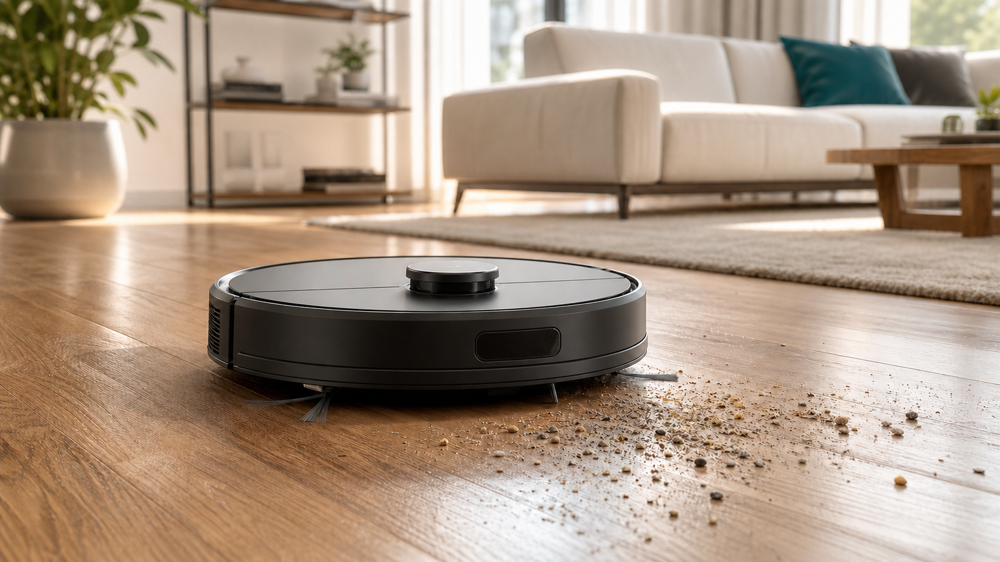

<!--
SPDX-FileCopyrightText: 2026 Elan8
SPDX-License-Identifier: MIT
-->

# Autonomous Floor Cleaning Robot (SysML v2)

[](LICENSE)
[](https://www.omg.org/spec/SysML/)
[](https://github.com/elan8/spec42)



SysML v2 model for an autonomous floor-cleaning robot. The model is used as an example for requirements traceability, subsystem architecture, behavior, verification, and analysis.

The workspace currently keeps one top-level package per `.sysml` file under [`model/`](model/) so `private import PackageName::*` resolves consistently across tools.

## Why This Exists

This repository gives systems engineers, tool builders, and educators a realistic SysML v2 corpus that is larger than a toy example but still small enough to read end to end.

It demonstrates how requirements, functional architecture, physical architecture, firmware allocation, safety analysis, verification, analysis cases, and stakeholder views can live together in one coherent model.

## Highlights

- Requirements-to-architecture-to-verification traceability across needs, system requirements, design elements, verification cases, and analyses.
- Functional and physical decomposition with explicit allocation layers.
- Implementation-facing interface control for PCB harnesses, software message contracts, firmware tasks, scheduler timing, and MCU deployment.
- Safety assurance, design trade studies, and technical margins instead of structure-only modeling.
- First-class SysML v2 views for context, structure, interconnections, behavior, traceability, safety, deployment, and rationale.

## Validation

This model was build and validated using Spec42.
Spec42 is open source at [`elan8/spec42`](https://github.com/elan8/spec42). Pull requests are also validated by the Spec42 GitHub Action in this repository.

## What Is Modeled

- Stakeholder needs, derived system requirements, verification cases, and analysis evidence.
- Functional capabilities for locomotion, cleaning, perception, navigation, power, docking, safety, and user interaction.
- Physical assemblies with typed electronics harnesses, power rails, firmware deployment, and implementation-facing interface control.
- Operating lifecycle behavior, operational scenarios, safety analysis, trade studies, and canonical SysML v2 views.
- A selected privacy-conscious SLAM variant using 2D dToF/LiDAR, wheel odometry, IMU, cliff sensing, and short-range ToF sensing.

## Design Limits

| Attribute                | Value                                 |
| ------------------------ | ------------------------------------- |
| BOM budget               | 400 EUR                               |
| Mass budget              | 5.0 kg                                |
| Battery capacity budget  | 12500 mAh (12.5 Ah at 14.4 V nominal) |
| Localization error limit | 150 mm                                |
| Safe-stop reaction limit | 100 ms                                |

The limits are defined in [`DesignLimits.sysml`](model/DesignLimits.sysml) and referenced by system requirements and analysis cases.

## Suggested Reading Order

1. [`StakeholderNeeds.sysml`](model/StakeholderNeeds.sysml) - user needs
2. [`SystemRequirements.sysml`](model/SystemRequirements.sysml) - derived system requirements
3. [`FunctionalArchitecture.sysml`](model/FunctionalArchitecture.sysml) - capabilities and functional composition
4. [`PhysicalProtocols.sysml`](model/PhysicalProtocols.sysml) - electronics library imports and product bus aliases
5. [`ProductContext.sysml`](model/ProductContext.sysml) - external actors and context boundary
6. [`ElectricalInterfaces.sysml`](model/ElectricalInterfaces.sysml) - PCB harness and connector records
7. [`InterfaceControl.sysml`](model/InterfaceControl.sysml) - software message contracts
8. [`FirmwareArchitecture.sysml`](model/FirmwareArchitecture.sysml) - firmware tasks and scheduler timing
9. [`PhysicalArchitecture.sysml`](model/PhysicalArchitecture.sysml) - product assemblies and typed physical connections
10. [`ArchitectureAllocations.sysml`](model/ArchitectureAllocations.sysml) - function, scenario, firmware, and MCU allocations
11. [`Architecture.sysml`](model/Architecture.sysml) - public architecture hub and system-level satisfy links
12. [`BehaviorStates.sysml`](model/BehaviorStates.sysml) - mission lifecycle states
13. [`OperationalScenarios.sysml`](model/OperationalScenarios.sysml) - nominal and recovery mission flows
14. [`SafetyAnalysis.sysml`](model/SafetyAnalysis.sysml) and [`TradeStudies.sysml`](model/TradeStudies.sysml) - hazards and design rationale
15. [`ModelViews.sysml`](model/ModelViews.sysml) - stakeholder views
16. [`Verification.sysml`](model/Verification.sysml) and [`AnalysisCases.sysml`](model/AnalysisCases.sysml) - V&V and engineering margins
17. [`AutonomousFloorCleaningRobotDemo.sysml`](model/AutonomousFloorCleaningRobotDemo.sysml) - full workspace import hub

## Useful Views

The [`ModelViews.sysml`](model/ModelViews.sysml) package defines three first-class SysML v2 views focused on core systems-engineering workflows:

- `productStructure` — robot part tree (physical breakdown, General View)
- `functionalArchitecture` — capability decomposition with bindings
- `requirementsTraceability` — linked needs, requirements, verification, and design (Requirement View)

With Spec42 diagram export support:

```powershell
spec42 diagrams export model --selected-view productStructure --format svg --output target/diagrams
spec42 diagrams export model --selected-view functionalArchitecture --format svg --output target/diagrams
spec42 diagrams export model --selected-view requirementsTraceability --format svg --output target/diagrams
```

## More Documentation

- [`docs/MODEL_GUIDE.md`](docs/MODEL_GUIDE.md) - model layers, package map, and engineering threads.
- [`docs/MODEL_CONVENTIONS.md`](docs/MODEL_CONVENTIONS.md) - naming, imports, comments, package ownership, and future folder structure.
- [`docs/VALIDATION.md`](docs/VALIDATION.md) - Spec42 setup, library paths, validation commands, and known tool notes.

## Known Limitations

- This is an engineering-grade showcase and validation corpus, not a certified product design or regulatory compliance package.
- The robot architecture is realistic enough for MBSE demonstration, but it is not a complete commercial robot-vacuum design.
- Generated documentation imagery is illustrative and not a product rendering from a manufactured device.
- The model currently keeps a flat `model/` folder for broad tool compatibility; a folder split should be validated as a separate change.

## Contributing

Contributions are welcome. Please read [`CONTRIBUTING.md`](CONTRIBUTING.md), follow [`docs/MODEL_CONVENTIONS.md`](docs/MODEL_CONVENTIONS.md), and run validation before opening a PR.

## License

This repository is licensed under the [MIT License](LICENSE). See [`NOTICE.md`](NOTICE.md) for trademark and showcase-disclaimer notes.
