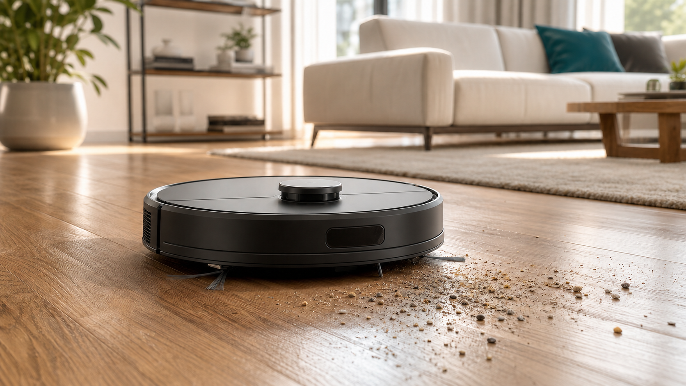

<!--
SPDX-FileCopyrightText: 2026 Elan8
SPDX-License-Identifier: MIT
-->

# Autonomous Floor Cleaning Robot (SysML v2)

[](LICENSE)
[](https://www.omg.org/spec/SysML/)
[](https://github.com/elan8/spec42)



A compact, graph-first SysML v2 showcase for an autonomous vacuum cleaner,
organized with the **Elan8 Method** folder layout. It uses one selected product
baseline, seven firmware tasks, six catalog parts and one cliff-safe-stop golden
thread (`INC-CLIFF-001`). Every view projects the same authoritative
requirements, behavior, architecture and verification elements.

## What the showcase demonstrates

- Elan8 Method concerns via folders `00_project` … `90_library`.
- Elan8 requirement roles/identities and engineering-increment metadata on the
  cliff-safe-stop spine.
- Definition/usage separation and one concrete `robotSystem` usage.
- Typed items, ports, connections, flows and allocations instead of internal
  identity encoded as strings.
- Requirements satisfied by concrete behavior usages and verified by nine
  verification cases plus three quantitative analyses.
- A reusable `PurchasedParts` library; named dependencies select catalog
  implementations without turning procurement choice into type specialization.
- Six curated views over the same graph.

The scope deliberately excludes product variants, trade studies, and
implementation handoff tables. Human-facing external identifiers such as
manufacturer part numbers stay text; internal model identity is semantic.

## Model map

| Path | Purpose |
| --- | --- |
| `00_project/Project.sysml` | Tailoring / method profile |
| `10_purpose/` | Context, needs, design limits, system requirements |
| `20_behavior/` | Capabilities, states, scenarios |
| `30_architecture/` | Domain, physical, firmware, SOI allocations |
| `40_analysis/` | Three quantitative analyses |
| `50_verification/` | Nine verification cases |
| `60_views/` | Six projections |
| `90_library/` | Units and purchased parts |
| `Root.sysml` | Workspace import hub |

See [MODEL_GUIDE.md](docs/MODEL_GUIDE.md) and [ELAN8_METHOD_TOUR.md](docs/ELAN8_METHOD_TOUR.md).

## Validation

Requires sibling checkouts of `sysml-domain-libraries` and `mbse-methodology`:

```powershell
powershell -ExecutionPolicy Bypass -File .\scripts\validate.ps1
```

The release criterion is 0 errors, 0 warnings and 0 information diagnostics,
followed by successful SVG export of all six views. See
[validation details](docs/VALIDATION.md).

## Status and limitations

This is an MBSE teaching and tool-validation model, not a certified product
design or production BOM. Catalog metadata was checked against official
manufacturer sources, but lifecycle and availability must be reviewed again
before procurement.

Contributions are welcome; keep changes graph-first, run validation and update
the focused documentation when the public model interface changes.

## License

Licensed under the [MIT License](LICENSE). See [NOTICE.md](NOTICE.md).
