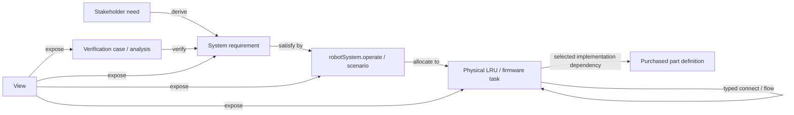

<!--
SPDX-FileCopyrightText: 2026 Elan8
SPDX-License-Identifier: MIT
-->

# Model guide

The model is intentionally small enough to read end to end. File paths follow
the Elan8 Method layout; SysML packages remain the semantic ownership boundary.

Start with the [Elan8 Method tour](ELAN8_METHOD_TOUR.md) for the cliff-safe-stop
vertical increment.

## Recommended tour

1. Start in `10_purpose/Requirements.sysml`: six stakeholder needs derive twelve
   testable requirements with quantities, constraints, and Elan8 requirement roles.
2. Read `20_behavior/FunctionalBehavior.sysml`: `OperateCleaningRobot` decomposes
   product behavior. Follow `CliffSafeStopGoldenThread` (`INC-CLIFF-001`).
3. Open `30_architecture/PhysicalArchitecture.sysml`: the selected baseline
   contains the major LRUs, typed interfaces, power rails, and catalog selections.
4. Follow `Architecture::robotSystem`. Its `operate` behavior usage is used for
   allocation and requirement satisfaction.
5. Inspect `30_architecture/FirmwareArchitecture.sysml`: seven tasks, queues, and
   timing.
6. Continue into `40_analysis/Analysis.sysml` (`SafetyReactionAnalysis`) and
   `50_verification/Verification.sysml` (`verifyCliffSafeStop`).
7. Finish with the six views in `60_views/ModelViews.sysml`.

## Semantic backbone

## Package ownership

| Package | Owns |
| --- | --- |
| `Project` | Tailoring and method profile |
| `VacuumCleanerQuantitiesAndUnits` | Project-specific units |
| `PurchasedParts` | `BuyPart` metadata and catalog definitions |
| `DomainModel` | Protocol vocabulary, items, ports, buses |
| `DesignLimits`, `StakeholderNeeds`, `SystemRequirements` | Product intent and constraints |
| `FunctionalArchitecture`, `BehaviorStates`, `OperationalScenarios` | Capabilities, states, scenarios |
| `ProductContext` | Users, app, network, dock, home, robot boundary |
| `FirmwareArchitecture` | Runtime tasks and queues |
| `PhysicalArchitecture` | Selected physical baseline |
| `Architecture` | Concrete system, allocations, satisfaction |
| `AnalysisCases` | Three analyses |
| `Verification` | Nine verification cases |
| `ModelViews` | Six stakeholder projections |

## Purchased parts

`BuyPart` is metadata for `SysML::PartDefinition`. Project definitions specialize
domain kinds; a named `dependency selectedImplementation` points at catalog parts.

## Deliberate boundaries

This baseline omits product-line engineering, trade studies, and handoff record
tables. It **does** use Elan8 Method libraries for requirement roles, concerns,
and increment identity on the cliff-safe-stop spine. Narrative guidance beyond
semantics belongs in `doc` and markdown tours.
