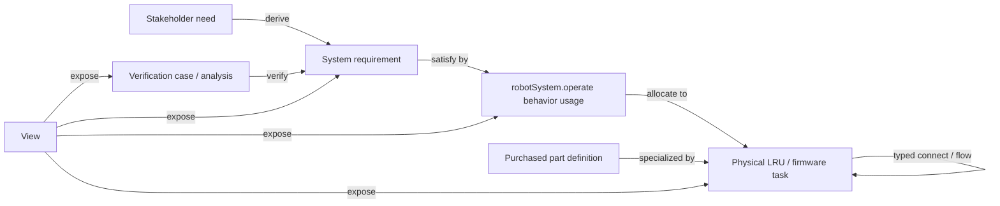

<!--
SPDX-FileCopyrightText: 2026 Elan8
SPDX-License-Identifier: MIT
-->

# Model guide

The model is intentionally small enough to read end to end. File paths organize
the workspace; SysML packages remain the semantic ownership boundary.

## Recommended tour

1. Start in `Requirements.sysml`: six stakeholder needs derive twelve testable
   requirements with quantities and constraints.
2. Read `FunctionalBehavior.sysml`: `OperateCleaningRobot` decomposes the
   product behavior. `RobotOperatingBehavior` and `PrivacyConsentBehavior` are
   the only state definitions.
3. Open `PhysicalArchitecture.sysml`: the selected baseline contains the major
   LRUs, typed interfaces, three power rails and concrete catalog-based parts.
4. Follow `Architecture::robotSystem`. Its single `operate` behavior usage is
   used for both allocation and requirement satisfaction.
5. Inspect `FirmwareArchitecture.sysml`: seven task definitions carry timing,
   criticality, WCET and memory data. Five runtime queue parts own typed
   producer/consumer flows and freshness limits.
6. Follow `OperationalScenarios::cliffSafeStopGoldenThread` from sensing,
   through safety supervision and actuation, to status reporting. The same
   elements continue into `SafetyReactionAnalysis` and
   `verifyCliffSafeStop`.
7. Finish with the six views in `ModelViews.sysml`; they select existing graph
   elements and do not duplicate handoff records.

## Semantic backbone

## Package ownership

| Package | Owns |
| --- | --- |
| `VacuumCleanerQuantitiesAndUnits` | Project-specific charge and duration units. |
| `PurchasedParts` | Generic `BuyPart` metadata and six catalog part definitions. |
| `DomainModel` | Protocol vocabulary, items, ports and bus structures. |
| `DesignLimits`, `StakeholderNeeds`, `SystemRequirements` | Product intent and formal constraints. |
| `FunctionalArchitecture`, `BehaviorStates`, `OperationalScenarios` | Capabilities, state behavior and two scenarios. |
| `ProductContext` | Users, app, network, dock, home and robot boundary. |
| `FirmwareArchitecture` | Runtime tasks, queues and item flows. |
| `PhysicalArchitecture` | Selected physical baseline, connections, rail budgets and peripheral allocations. |
| `Architecture` | Concrete system usage, functional allocations and satisfaction. |
| `AnalysisCases`, `Verification` | Three analyses and nine verification cases. |
| `ModelViews` | Six stakeholder projections. |

## Purchased parts

`BuyPart` is metadata for `SysML::PartDefinition`, not a project-specific
record table. It stores manufacturer identity and document provenance.
Voltage and temperature limits remain typed quantities on the catalog
definitions. Project definitions such as `RobotMainMcu` specialize catalog
definitions such as `STM32U575VGT6`; the physical product uses the project
definitions directly.

The library imports only standard and domain libraries. It therefore has no
references to the vacuum-cleaner architecture and can later be extracted to a
sibling repository without changing project usage semantics.

## Deliberate boundaries

This baseline omits product-line engineering, custom assurance records, detailed
PCB implementation data, commercial evaluation and methodology metadata. Add a
new concept only when it creates a useful semantic relationship or a formal
engineering constraint; narrative guidance belongs in `doc`.
